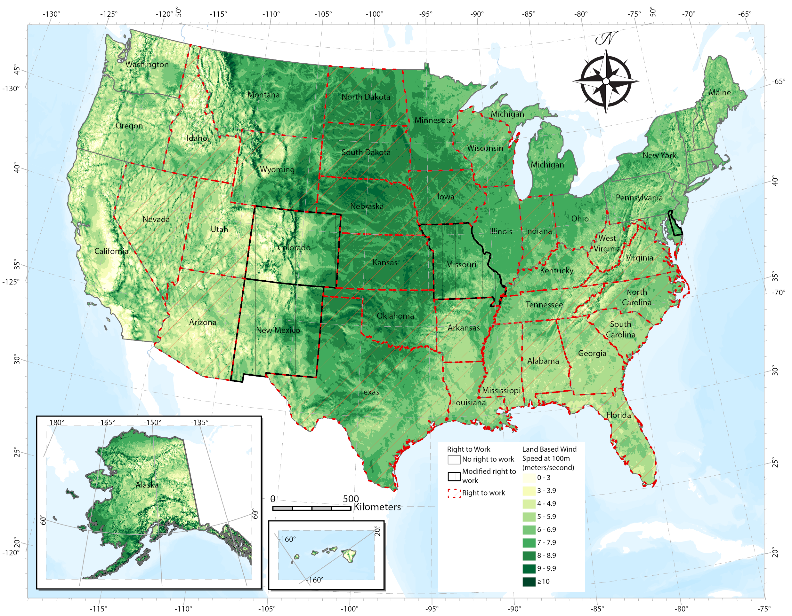

# My Design Portfolio  

Here, you'll find a collection of my design work categorized into three sections:  

- **Academic Designs** – Work related to research, education, and scholarly communication.  
- **Static Designs** – Visual compositions such as posters, infographics, and branding materials.  
- **Moving Designs** – Animations, motion graphics, and interactive visuals.  

---

## 📖 Academic Designs  
_A collection of visually engaging academic projects._  

- **[Wind Production Network](#)** – An image that summarizes key components of wind production networks.  
- **[Green Jobs Typology](#)** – _In progress_.
- **[US Wind Energy and Right to Work](content/img/RightToWorkUsFinal.png)** – A map that displays wind resources across the US in comparison to right to work states.
- 

---

## 🎨 Static Designs  
_Still images, posters, and creative layouts._  

| Thumbnail | Description |
|-----------|------------|
|  | **[Design Title](#)** – A brief summary of the work. |
|  | **[Design Title](#)** – Another project description. |

---

## 🎬 Moving Designs  
_Animations and interactive media._  

### 📌 Featured Motion Project  
🎥 **[Project Name](#)** – A brief description of the moving design, with a link to a video or interactive file.  

- **[Project Name](#)** – Short description.  
- **[Project Name](#)** – Another project description.  

